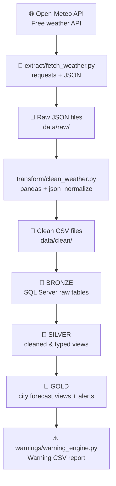

# 🌦️ Pakistan Weather Warning Pipeline


An end-to-end data engineering pipeline that collects live weather
data for 5 major Pakistani cities, transforms and loads it into a
SQL Server warehouse using **Bronze → Silver → Gold** medallion
architecture, and generates automated weather warning reports.

---

## 🏙️ Cities Covered

Karachi · Lahore · Islamabad · Peshawar · Quetta

---

## 🔄 Pipeline Flow



| Stage | What happens |
|:--|:--|
| 🌐 **Source** | Open-Meteo API — free, no key needed |
| 🐍 **Extract** | Pulls current + 7-day hourly data for 5 cities |
| 🐼 **Transform** | Flattens JSON, cleans columns, adds timestamps |
| 🥉 **Bronze** | Raw string data landed in SQL Server |
| 🥈 **Silver** | Proper types cast, nulls handled |
| 🥇 **Gold** | City views with weather alerts pre-applied |
| ⚠️ **Warnings** | Python reads gold views, saves warning report |

---

## ⚙️ What Each Layer Does

### 🐍 1. Extract — `extract/fetch_weather.py`
- Calls Open-Meteo API for each city using coordinates
- Retrieves current conditions + 168 hours of forecast data
- Saves raw JSON response to `data/raw/` with timestamp

### 🐼 2. Transform — `transform/clean_weather.py`
- Flattens nested JSON using pandas
- Cleans column names and data types
- Maps weather codes to human-readable descriptions
- Saves two clean CSVs: `current_weather.csv` and `hourly_weather.csv`

### 🥉 3. Bronze — `load/load_to_db.py`
- Reads clean CSVs and loads into SQL Server
- All columns stored as String — raw landing zone
- Truncates and reloads on every pipeline run

### 🥈 4. Silver — `sql/silver_layer.sql`
- Creates views that cast strings to proper types
- `FLOAT` for temperature, windspeed, precipitation
- `INT` for weathercode and is_day

### 🥇 5. Gold — `sql/gold_layer.sql`
- One view per city showing clean forecast data
- Applies warning thresholds inline:
  - Temperature > 42°C → DANGER - Heatwave
  - Temperature > 38°C → WARNING - Hot Weather
  - Windspeed > 60 km/h → DANGER - Storm
  - Windspeed > 40 km/h → WARNING - Strong Wind

### ⚠️ 6. Warnings — `warnings/warning_engine.py`
- Reads gold views for all 5 cities
- Collects rows where alert level is not Normal
- Saves `data/warnings/latest_warnings.csv`
- Prints summary to terminal

---

## 🛠️ Tools Used

| Tool | Purpose |
|:--|:--|
| 🐍 Python | Core pipeline language |
| 🌐 requests | API calls to Open-Meteo |
| 🐼 pandas | Data transformation and cleaning |
| 🗄️ SQL Server | Warehouse and medallion architecture |
| 🔗 SQLAlchemy | Python to SQL Server connection |
| 🔑 pyodbc | ODBC driver for SQL Server |

---

## 📁 Project Structure

```
pakistan-weather-pipeline/
│
├── pipeline.py                    # Run this to execute full pipeline
│
├── extract/
│   └── fetch_weather.py           # API extraction for 5 cities
│
├── transform/
│   └── clean_weather.py           # JSON flattening and cleaning
│
├── load/
│   └── load_to_db.py              # SQL Server bronze loader
│
├── warnings/
│   └── warning_engine.py          # Gold view reader + alert generator
│
├── analysis/
│   └── weather_analysis.sql       # Ad-hoc SQL analysis queries
│
├── sql/
│   ├── bronze_tables.sql          # Bronze schema and table definitions
│   ├── silver_layer.sql           # Silver typed views
│   └── gold_layer.sql             # Gold city views with alert logic
│
├── data/
│   ├── raw/                       # Raw JSON responses (gitignored)
│   ├── clean/                     # Clean CSVs (gitignored)
│   └── warnings/                  # Warning reports (gitignored)
│
└── README.md
```

---

## ▶️ How to Run

**Prerequisites:**
- Python 3.14
- SQL Server with ODBC Driver 17
- WeatherDB database with bronze, silver, gold schemas created

**Install dependencies:**
```bash
pip install pandas sqlalchemy pyodbc requests
```

**Run the full pipeline:**
```bash
python pipeline.py
```

**Or run individual steps:**
```bash
python extract/fetch_weather.py       # Extract only
python transform/clean_weather.py     # Transform only
python load/load_to_db.py             # Load only
python warnings/warning_engine.py     # Warnings only
```

---

## 🧠 Skills Demonstrated

- REST API consumption and JSON handling
- Nested JSON flattening with pandas json_normalize
- ETL pipeline design in Python
- Medallion architecture (Bronze / Silver / Gold)
- SQL Server: schema design, typed views, CASE WHEN alerts
- SQLAlchemy for Python to SQL Server integration
- Git version control throughout development
- Modular, production-style project structure